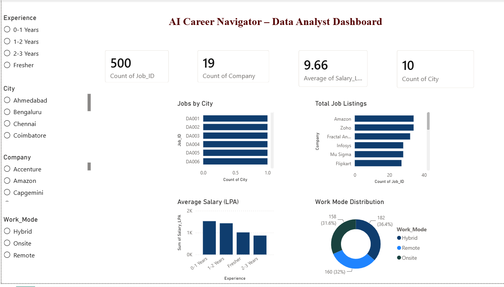

# 🧠 AI Career Navigator – Data Analyst Project

End-to-end Data Analytics project using Python, SQL, and Power BI.

---

## 📊 Dashboard Preview

---

## 🛠️ Tools Used
- Python
- SQL
- Power BI
- Excel

---

## 📊 Key Insights
- Top hiring cities
- Highest paying companies
- In-demand skills
- Work mode analysis

---

## 🎯 Outcome
Built a dashboard to understand job market trends.

---

## 💡 About
Real-world style data analysis project.

---

## 🔗 Project Link
https://github.com/Aglin-20/AI_Career_Navigator

